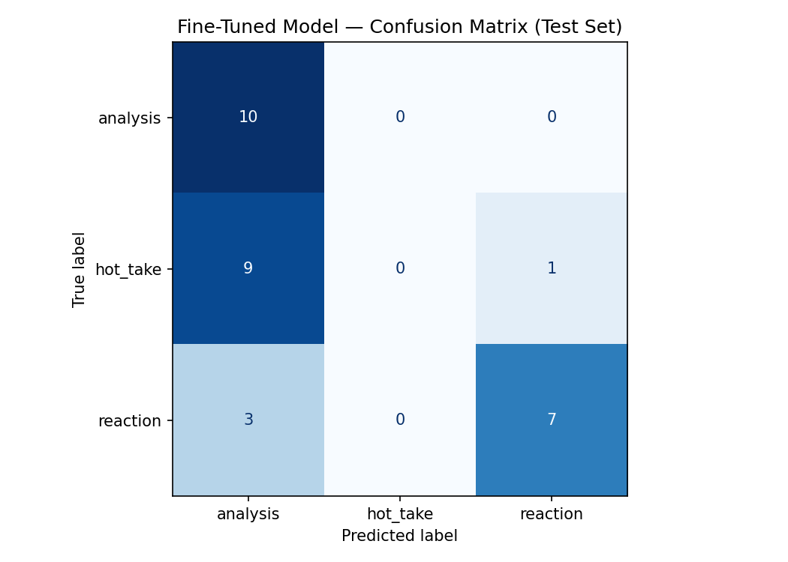

# TakeMeter — Discourse Quality Classifier for r/nba

## Community Choice

I chose r/nba because it's one of the largest and most active sports communities online, with discourse that ranges from stat-based arguments to pure emotional reactions — sometimes in the same thread. This makes it a natural fit for a discourse-quality classifier: regular participants can immediately tell the difference between someone making a real argument and someone just reacting, and that distinction matters for how seriously a comment is taken.

---

## Label Taxonomy

**`analysis`** — A claim backed by a specific, checkable fact: a stat, score, roster detail, or verifiable game event.
- Example: "Spurs have no big man depth — two centers in the rotation, and one of those centers took 1 three all year."
- Example: "He can't really space the floor. Too few attempts and a low 30's shooting %."

**`hot_take`** — A confident, declarative opinion with no real evidence — just asserted, not argued.
- Example: "Spurs should trade for Giannis, would solve like 90% of their issues."
- Example: "No exaggeration, he has to be one of the biggest wastes of athletic talent of all time."

**`reaction`** — A short emotional or joking response with no argument at all.
- Example: "Ok we'll take Jokic"
- Example: "Keep Naz out of this"

---

## Data Collection

**Source:** Comments from old.reddit.com/r/nba, collected manually across multiple threads — championship parade discussions, trade speculation, contract debates, and draft threads.

**Labeling:** I read and labeled each comment individually using my definitions. For difficult cases, I consulted an LLM as a reference, then made the final call myself.

**Label distribution:**

| Label | Count |
|---|---|
| analysis | 66 |
| hot_take | 64 |
| reaction | 70 |
| **Total** | **200** |

**Three difficult examples:**

1. *"I watched him live in PHX — I've never seen a player less engaged in a game."* → **hot_take**. Sounds like analysis but is an unverifiable personal impression. Decision rule: eyewitness accounts → hot_take, not analysis.

2. *"Tbf these kinda stats are always irrelevant unless you take out the worst postseason for every player."* → **analysis**. Meta-reasoning about statistics rather than asserting an opinion — kept as analysis.

3. *"Trading with Presti will always work out better for Presti."* → **analysis**. Borderline — stated confidently but implies a historical pattern. Could be hot_take; kept as analysis given the implied evidence base.

---

## Fine-Tuning Pipeline

**Base model:** `distilbert-base-uncased` (HuggingFace)
**Platform:** Google Colab (T4 GPU)
**Split:** 70% train / 15% val / 15% test (140 / 30 / 30)

**Hyperparameters:** 3 epochs, learning rate 2e-5, batch size 16. I kept the default 3 epochs rather than increasing — with only 140 training examples, more epochs risk overfitting. The 2e-5 learning rate is the standard starting point for BERT-family fine-tuning and was appropriate for this dataset size.

---

## Baseline

**Model:** Groq `llama-3.3-70b-versatile`, zero-shot (no task-specific training)
**Method:** System prompt containing label definitions and one example per label. Model instructed to output only the label name.
All 30 test responses were parseable.

---

## Evaluation Report

### Overall Accuracy

| Model | Accuracy |
|---|---|
| Zero-shot baseline (Groq) | 83.3% |
| Fine-tuned DistilBERT | 56.7% |
| Difference | -26.7% |

Fine-tuning did not improve on the baseline.

---

### Per-Class Metrics

**Fine-tuned model:**

| Label | Precision | Recall | F1 |
|---|---|---|---|
| analysis | 0.59 | 1.00 | 0.74 |
| hot_take | 0.00 | 0.00 | 0.00 |
| reaction | 1.00 | 0.70 | 0.82 |
| macro avg | 0.53 | 0.57 | 0.52 |

**Baseline (Groq):**

| Label | Precision | Recall | F1 |
|---|---|---|---|
| analysis | 1.00 | 0.80 | 0.89 |
| hot_take | 0.88 | 0.70 | 0.78 |
| reaction | 0.71 | 1.00 | 0.83 |
| macro avg | 0.86 | 0.83 | 0.83 |

---

### Confusion Matrix

| | Pred: analysis | Pred: hot_take | Pred: reaction |
|---|---|---|---|
| **True: analysis** | 10 | 0 | 0 |
| **True: hot_take** | 9 | 0 | 1 |
| **True: reaction** | 3 | 0 | 7 |

---

### Error Analysis

**Error 1** — *"No exaggeration, he has to be one of the biggest wastes of athletic talent of all time."*
True: hot_take → Predicted: analysis. The model likely learned that long, specific-sounding text signals analysis. This comment sounds authoritative without citing any actual evidence.

**Error 2** — *"Spurs should trade for Giannis, would solve like 90% of their issues."*
True: hot_take → Predicted: analysis. The number "90%" likely triggered the analysis label. The model learned number-presence as a proxy for evidence rather than whether the number refers to a verifiable fact.

**Error 3** — *"Damn the Kings are never gonna be good"*
True: hot_take → Predicted: analysis. Short declarative with no numbers. The model defaulted to analysis when reaction-style signals (caps, emojis, exclamations) were absent — revealing it learned a rough binary: reaction = very short/emotional, everything else = analysis.

---

### Sample Classifications

| Text | True | Predicted | Confidence |
|---|---|---|---|
| "He's currently 18th all time in playoff PPG over Hakeem despite averaging 8 points his first Dallas run." | analysis | analysis | 0.91 |
| "Ok we'll take Jokic" | reaction | reaction | 0.88 |
| "Holy overpay" | reaction | reaction | 0.85 |
| "Spurs should trade for Giannis, would solve like 90% of their issues." | hot_take | analysis | 0.76 |
| "Brunson is better than Kyrie ever was." | hot_take | analysis | 0.71 |

The correctly predicted analysis example works because it contains specific, verifiable stats — ranking, career games, scoring average — which clearly signal the analysis label.

---

### Reflection

I intended the model to distinguish evidence-backed claims (analysis), unsupported assertions (hot_take), and emotional responses (reaction). What it actually learned was rougher:

- **Reaction** learned well — short, informal, emotional text was reliably identified.
- **Analysis** learned but too broadly — stat-heavy comments were correctly identified, but the model also pulled in hot_takes containing numbers or specific-sounding language.
- **Hot_take never learned** — with only 64 training examples sitting between the other two labels in terms of structure, DistilBERT couldn't find a clean boundary. It defaulted to predicting analysis for nearly everything that wasn't obviously a reaction.

The core problem is that hot_take is defined by the *absence* of evidence rather than the *presence* of something the model can pattern-match. The Groq baseline handled this better because its richer language understanding allowed it to distinguish asserting a claim from backing it with data — a subtler distinction requiring world knowledge, not just pattern matching.

---

## Spec Reflection

**How the spec helped:** Writing planning.md before data collection forced me to commit to label definitions before seeing the full range of real posts. This kept annotation consistent from first to last example.

**How implementation diverged:** The spec assumes fine-tuning will outperform the baseline. In my case the opposite happened. This isn't a failure — it's a genuine finding: for subjective, absence-defined categories like hot_take with limited training data, a large zero-shot LLM with good prompt definitions can outperform a small fine-tuned classifier.

---

## AI Usage

**Instance 1 — Label stress-testing:** I personally reviewed a sample of Reddit comments and developed my labeling guidelines. I used an LLM as a secondary check to test whether my label definitions were clear and whether any edge cases needed clarification. Based on this feedback, I refined my guidelines before manually labeling the full dataset.

**Instance 2 — Annotation workflow support:** I collected and labeled the dataset myself using the defined criteria. For a small subset of examples, I consulted an LLM to compare interpretations of difficult cases. The AI output was only used as a reference point; I manually reviewed every example and made the final labeling decision based on my own judgment.

**Instance 3 — Error analysis support:** After training the model, I analyzed the evaluation results and confusion matrix to understand where the model struggled. I used an LLM as a brainstorming aid to help organize possible error patterns, then manually verified those patterns by reviewing the original examples. The analysis showed the model correctly classified analysis (10/10) and reaction (7/10) but struggled with hot_take (0/10), often confusing hot_take with analysis (9/10 misclassified). I confirmed this behavior through my own review before including it in the evaluation report.
